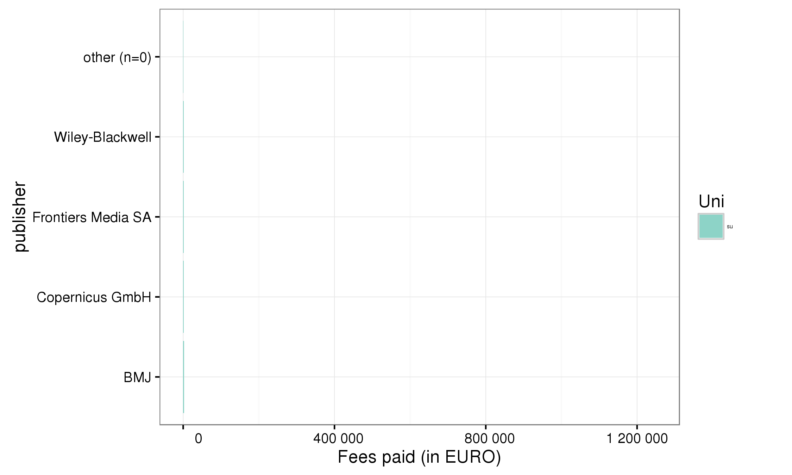
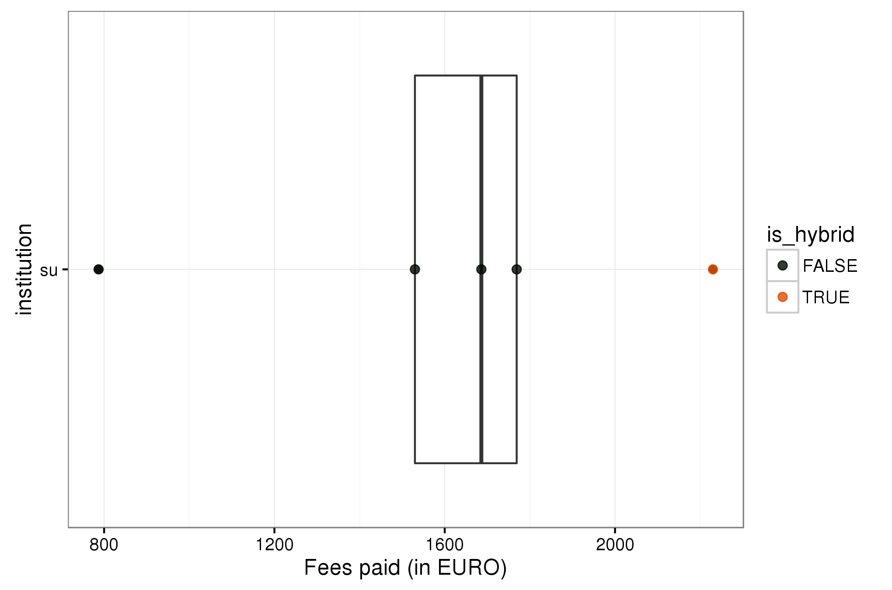
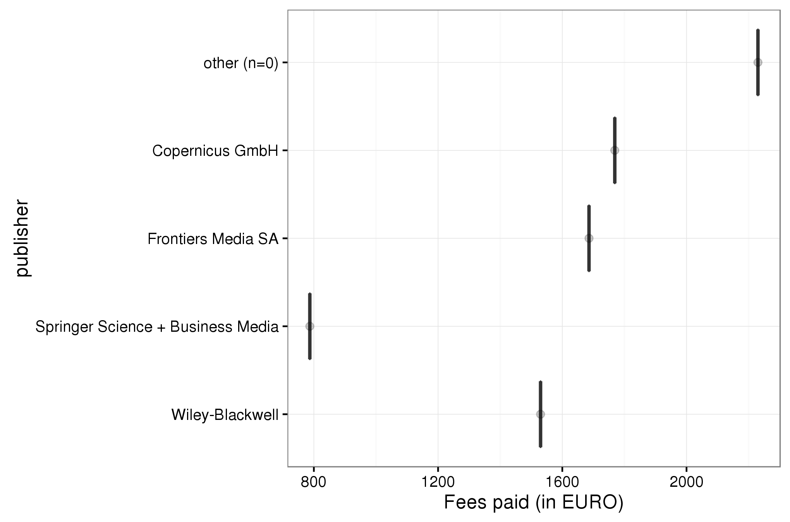
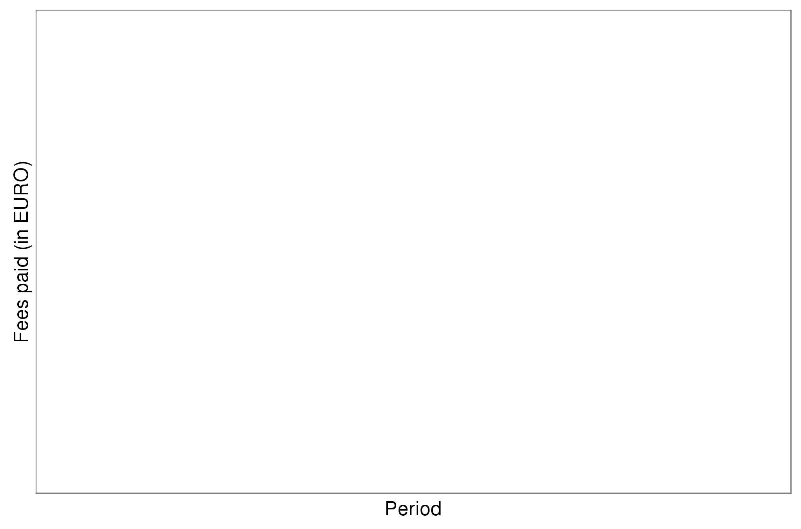

# About Openapc-se

This is a pilot project initiated by the National Library of Sweden together with Swedish higher education institutions (HEIs). The apc survey below includes only journal articles.   

A first [report](http://www.kb.se/dokument/open%20access/Open_APC_Sweden_English_LAST.pdf) from the pilot with the results from the initial workshop is now published at [OpenAccess.se](http://www.kb.se/openaccess/Open-APC-Sweden/). The report concludes that Sweden has currently no common funding system in place in order to finance and handle invoices for Article Processing Charges (APCs) paid in order to publish open access articles, fulfilling the demands of research funders. A Swedish open APC database, like the Open APC Initiative in Germany, would therefore be difficult to implement in Sweden at present. 

A pilot project named "Open APC Sweden" was initiated by the National Library of Sweden together with Swedish HEIs in order to investigate the possibilities of establishing an open database. The result from the first workshop proposes two options which could dramatically facilitate the collection and monitoring of Swedish APC data. Firstly, Swedish HEIs need to establish a common invoice code for APCs in their respective accounts and invoice processing systems. Secondly, institutional repositories need to enable the registration of metadata about “corresponding author”, who receives and pays for incurred APC costs via an invoice directly addressed to the author in question.

In order to establish "Open APC Sweden" there is a great need for a concerted effort by stakeholders. The current project aims to keep the Swedish HEI sector informed about ways in which to monitor the total cost of publication, which includes the collection of APCs. 

#### Open APC Sweden Symposium 2016
On the **25th of November** the National Library of Sweden invited all stakeholders to attend a national symposium on APCs and "Open APC Sweden". 

Prof. Stephen Pinfield at the University of Sheffield delivered the keynote speech regarding the total cost of publication in a hybrid open access environment, followed by representatives from Swedish HEIs and funding agencies presenting their experiences of monitoring APCs in Sweden.  

The presentations from the symposium are published at: [Open APC Sweden](http://www.kb.se/openaccess/Open-APC-Sweden/).

## Aim
**The aim of this openapc-se repository is to:**  

* Release datasets on fees paid for open access journal articles by the Swedish HEI sector under an Open Database Licence

* Demonstrate how reporting on fee-based open access publishing can be made more transparent and reproducible across institutions. This is an important aspect in the preparation for a transition from a subscription-based market to an open access publishing infrastructure 

* Establish a valid empirical foundation which can only be realised by standardised reporting on APC costs

Please see the [wiki](https://github.com/Kungbib/openapc-se/wiki/Open-APC-Sweden) for more information.

## Acknowledgement  
This project follows the [Open APC Initiative](https://github.com/OpenAPC/openapc-de) to share data on paid APCs. It recognises efforts from [JISC](https://www.jisc-collections.ac.uk/Jisc-Monitor/APC-data-collection/) and [FWF](https://figshare.com/articles/Austrian_Science_Fund_FWF_Publication_Cost_Data_2014/1378610) to standardise APC reporting.    

## Pilot contributors 
(institution code in parenthesis)

1. Linköping University (liu)  
2. Malmö University (mah)
3. The National Library of Sweden (kb)   
4. Stockholm University (su)   
5. Swedish University of Agricultural Sciences (slu)

## Dataset

Information on both open access journal articles and open access publication of articles in toll-access journals ("hybrid") are provided.

In total,  19434 € for  11 articles were paid by the participating unviversities. Average  fee is 1766.7 € and the median 1769 €.

## Open Access Journals

At the moment, the dataset releases information on 7 articles in open access journals which charge publication fees. Total expenditure amounts to  9311 €. Average  fee is 1330.1 € and the median 1530 €.

View dataset on [GitHub](https://github.com/OpenAPC/openapc-de/blob/master/data/apc_se.csv).

|    | Articles| Fees paid in EURO| Mean Fee paid| Median|
|:---|--------:|-----------------:|-------------:|------:|
|mah |        3|              3539|       1179.67|   1311|
|su  |        4|              5772|       1443.00|   1608|

## Hybrid articles

In many toll-access journals some of the articles are open access after a fee has been paid. This model is often called "hybrid open access".
The dataset covers 4 hybrid open access articles. Total expenditure amounts to  10123 €. Average  fee is 2530.8 € and the median 2631 €.

The following institutions have contributed its expenditures for hybrid open access.

|    | Articles| Fees paid in EURO| Mean Fee paid| Median|
|:---|--------:|-----------------:|-------------:|------:|
|mah |        3|              7893|          2631|   2631|
|su  |        1|              2230|          2230|   2230|

## Sample Visualisations

### Distribution over publishers by university

### Comparing fees paid by university and research institution

### Average fees paid by publisher

### Average fees Max Planck Digital Library paid for Springer Open Access articles by year

## Contributing APC data
See [guidelines for the template](https://github.com/Kungbib/openapc-se/wiki/Guide-for-completing-the-survey).

## Contact

For general comments, email Beate Eellend at the National Library of Sweden: **beate.eellend [at] kb.se** 

For technical comments, contact Ulf Kronman at the National Library of Sweden: **ulf.kronman [at] kb.se**

[Page updated 2016-12-14]