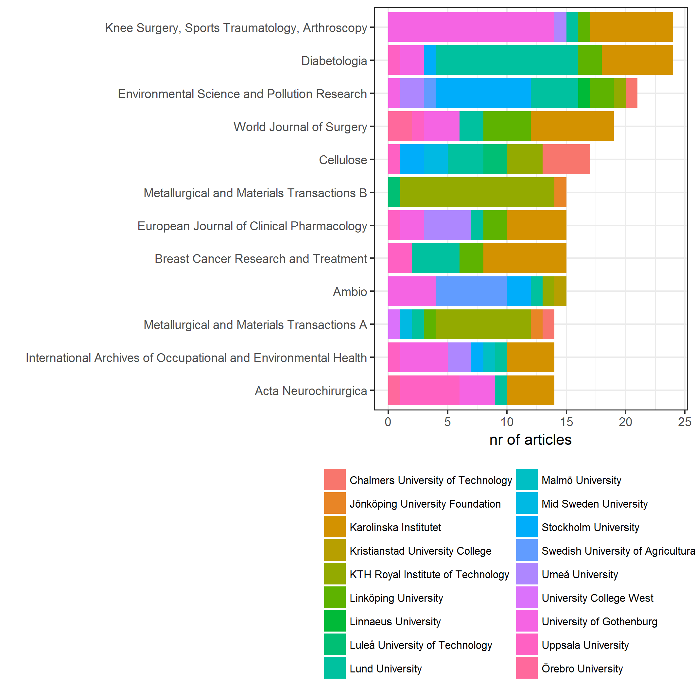
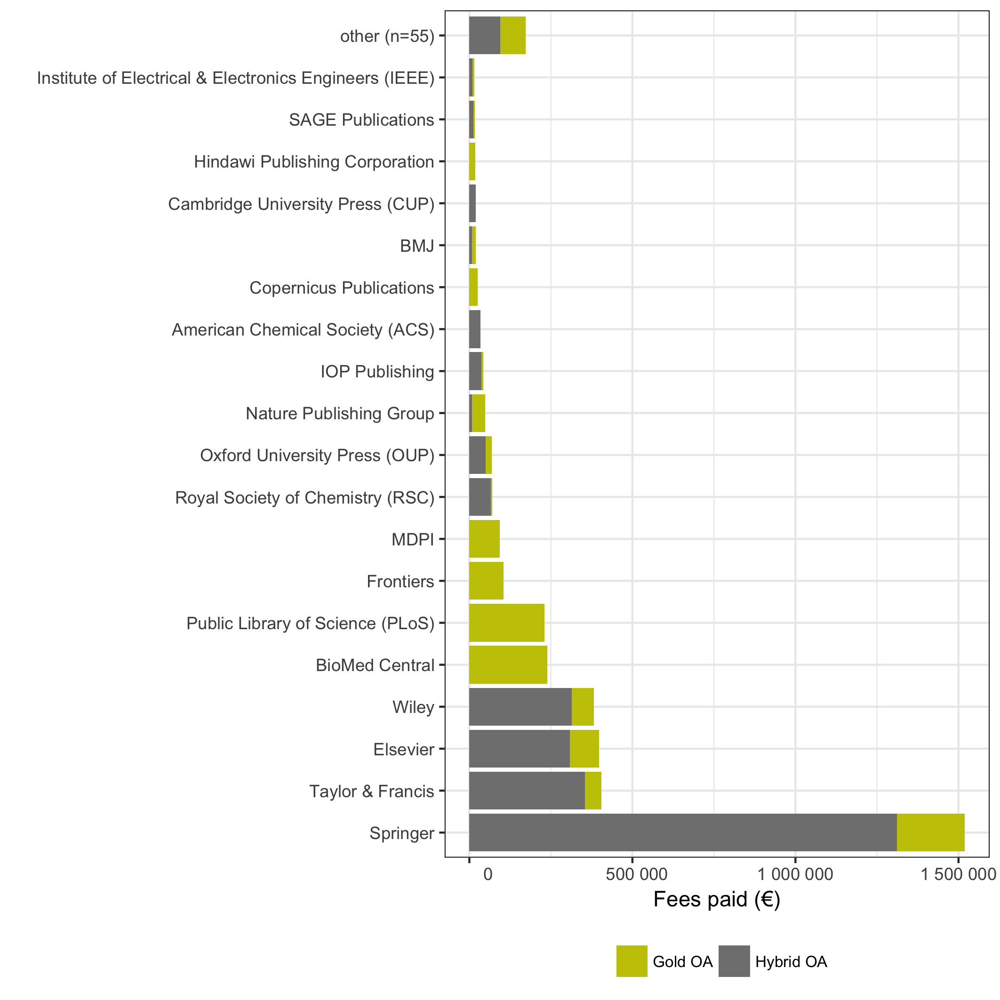
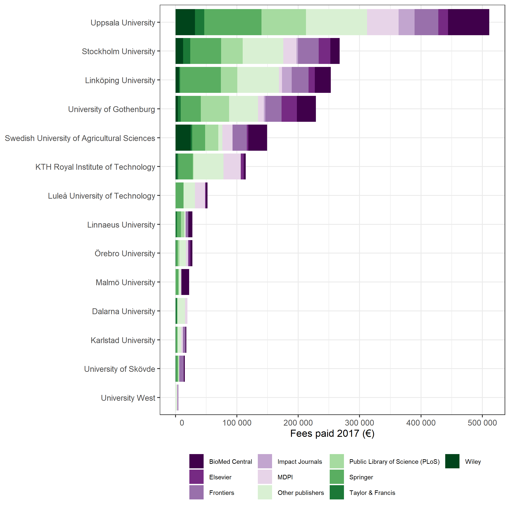
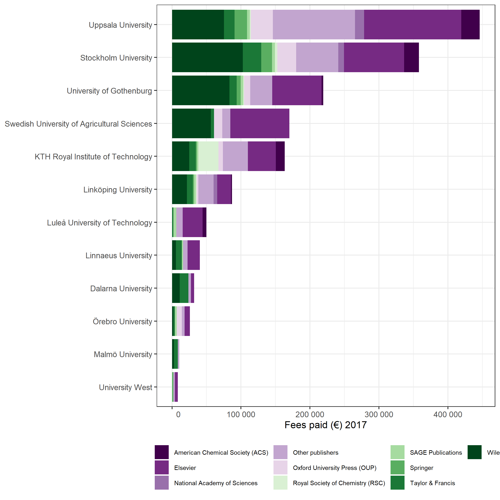
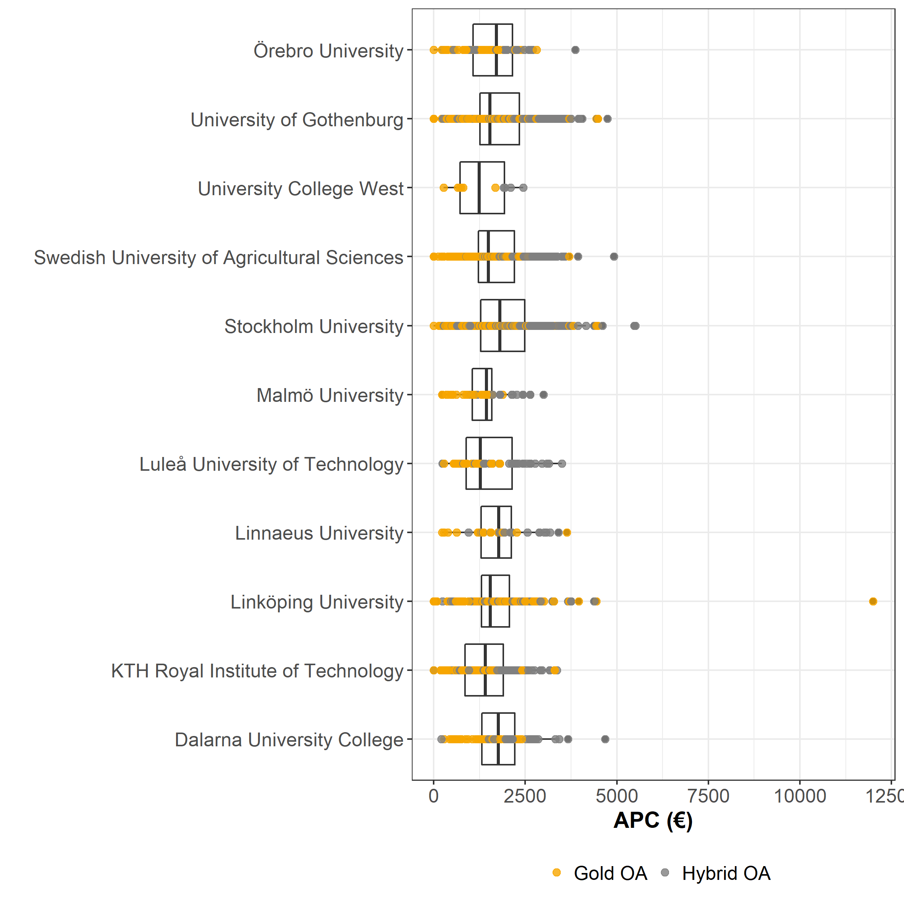
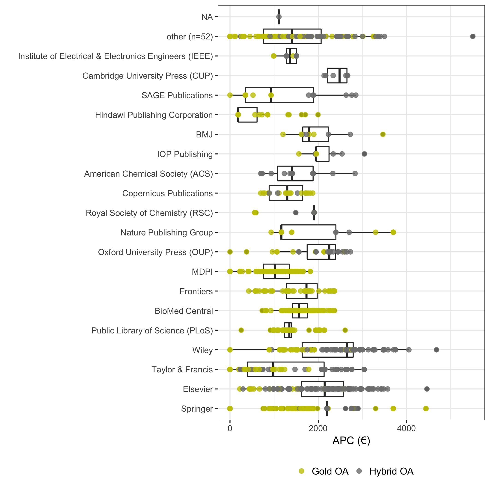
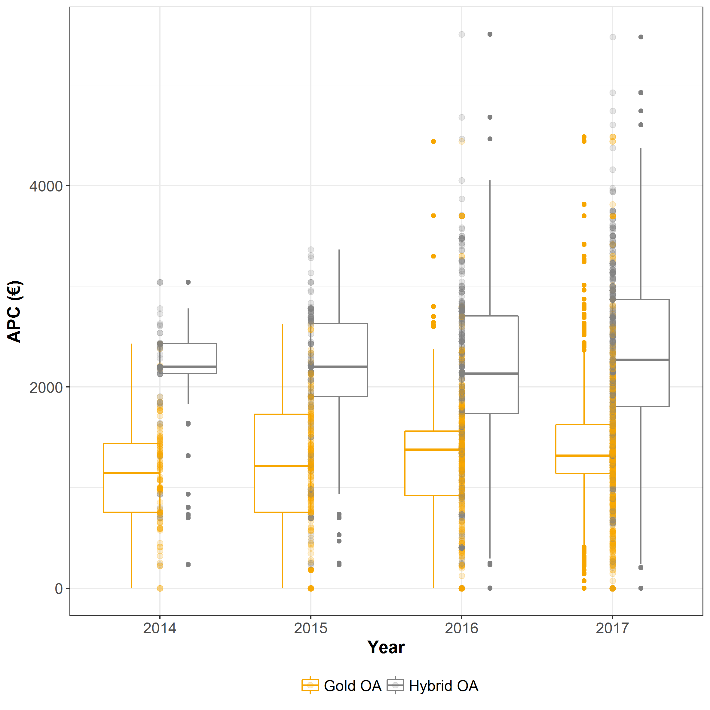
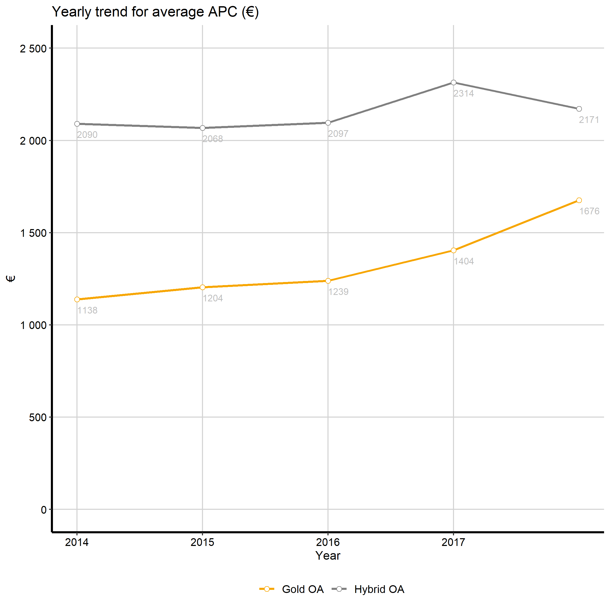

---
output:
    md_document: default
---

```{r, echo = FALSE, warning = TRUE}

# knitr::opts_knit$set(base.url = "/")
knitr::opts_chunk$set(
  comment = "#>",
  collapse = TRUE,
  warning = FALSE,
  message = FALSE,
  echo = FALSE
)
options(scipen = 999, digits = 0)
knitr::knit_hooks$set(inline = function(x) {
  prettyNum(x, big.mark = " ")
}
)
```

```{r preparing data}
# ToDo:
# bold marking of delivering insts in first table
# Order vectors w univs and publishers alphabetically
# write datasets to files, for example offset
# addera år för offset-redovisning

# NB: This code block has to be run first to create the basic datasets needed by code further down
# Note the extra libraries needed

library(tidyverse)
library(kableExtra)
library(ggplot2)
library(ggthemes)
library(RColorBrewer)

# Create the basic full dataset, combined with organisation names
apc_se <- read_csv("data/apc_se.csv")
# Combine with acronym-name-map to get full organisation names
code_name <- read_tsv("data/org_acronym_name_map.tsv")
# Join datasets on institution and acronym
apc_se <- left_join(x = apc_se, y = code_name, by = c("institution" = "acronym"))


# Create subsets 
# Create a gold OA subset
apc_se_gold <- filter(apc_se, is_hybrid == FALSE)

# Create a OA hybrid subset
apc_se_hybrid <- filter(apc_se, is_hybrid == TRUE)

# Create a offset subset
apc_se_offset <- read_tsv("data/springer_data.tsv")
apc_se_offset <- left_join(x = apc_se_offset, y = code_name, by = c("institution" = "acronym"))

#Create a non-offset subset
apc_se_not_offset <- read_tsv("data/apc_se_without_springer.tsv")
apc_se_not_offset <- left_join(x = apc_se_not_offset, y = code_name, by = c("institution" = "acronym"))

#Create a non-offset hybrid subset (gold subset not part of offset deals)
apc_se_hybrid_not_offset <- filter(apc_se_not_offset, is_hybrid == TRUE)


#Create vectors for orgs & publishers actively delivering data
deliv_orgs <- c("kth", "su", "gu", "slu", "du", "ltu", "liu", "mah", "hv", "oru", "lnu")
deliv_publishers <- c("Springer Compact", "Taylor & Francis", "Karger", "IOP Publishing", "Copernicus")
offset_deals <- c("Springer")
```
# Open APC Sweden - Statistics

This is an example of statistics from the pilot project Open APC Sweden, aiming at gathering data about article processing charges (APC"s) paid by Swedish universities. The statistics cover journal articles published mainly between 2014 and **`r max(apc_se$period)`** from **`r length(deliv_orgs)`** contributors. Please see the [project wiki](https://github.com/Kungbib/openapc-se/wiki) for more information about the project and instructions on how to contribute.

## Contributing organisations and publishers

These Swedish HEIs have reported APC costs for their articles so far: 

```{r delivering orgs}
#hämta upp dessa med deliv_orgs
current_deliv_orgs <- filter(code_name, acronym %in% deliv_orgs)
knitr::kable(current_deliv_orgs$organisation, col.names = "Delivering HEIs")
```

A number of publishers have also supplied Open APC Sweden with data: 

```{r echo=FALSE, cache = FALSE}
knitr::kable(deliv_publishers, col.names = "Publishers")
```

This publisher-supplied data leads to publishing costs being reported for a number of Swedish research institutions which not yet have supplied us with data actively.

## Dataset

Information on both open access journal articles, open access publication of articles in toll-access journals ("hybrid") and articles published within current Swedish offset deals are provided. You may view the dataset at the [project page in GitHub](https://github.com/Kungbib/openapc-se/blob/master/data/apc_se.csv).

## Open Access Articles (Total: "gold", "hybrid" and "offset")

At the moment, the dataset contains the following information:

* Number of articles: **`r nrow(apc_se)`** 
* Total expenditure: **`r format(sum(apc_se$euro), scientific=FALSE)` €** 

Articles and APC costs per institution (note that both delivering and non-delivering institutions are included):

```{r, apc summary per orgs}

apc_summary <- apc_se %>%
    group_by(organisation) %>%
    summarise(
        Articles= n(),
        Fees = sum(euro)
           )

names(apc_summary) <- c("Organisation", "Articles", "Fees paid (€)")

#how to make bold delivering rows?

knitr::kable(apc_summary, digits = 0, format.args = list(big.mark = " "))

```

## Articles in Open Access journals ("gold OA"), offset articles excluded

At the moment, the dataset contains the following information on articles in open access journals:

* Number of articles: **`r nrow(apc_se_gold)`** 
* Total expenditure:  **`r format(sum(apc_se_gold$euro), scientific=FALSE)` €** 
* Average fee: **`r format(sum(apc_se_gold$euro)/nrow(apc_se_gold), digits = 4)` €** 
* Median fee: **`r median(apc_se_gold$euro)` €**
* Share of articles with no fees: **`r format(100 * sum(apc_se_gold$euro == 0)/nrow(apc_se_gold), digits = 2)` %**

Gold OA and APC costs per institution (note that both delivering and non-delivering institutions are included):

```{r, open access journals articles}

apc_summary_gold <- apc_se_gold %>%
    group_by(organisation) %>%
    summarise(
        Articles= n(),
        Fees = sum(euro),
        Mean = mean(euro),
        Median = median(euro),
        Share_no_fees = 100*mean(euro == 0)
    )

names(apc_summary_gold) <- c("Organisation", "Articles", "Fees paid (€)", "Mean APC (€)",
                                        "Median APC (€)", "Share of articles w/o fee (%)")

knitr::kable(apc_summary_gold, digits = 0, format.args = list(big.mark = " "))
```

The following diagram shows the most used open access journals for publishing gold articles.

```{r gold most used journals}
#find top10 gold journals
top10publ_gold <- apc_se_gold %>%
    count(journal_full_title, publisher) %>%
    top_n(10) %>%
    arrange(desc(n))

names(top10publ_gold) <- c("Journal title", "Publisher", "Nr of articles")

knitr::kable(top10publ_gold, digits = 0, format.args = list(big.mark = " "))
```

## OA articles in subscription journals ("hybrid OA"), offset articles excluded

In many subscription journals some of the articles are open access after a fee has been paid. This model is called "hybrid open access".
The dataset covers the following data on hybrid open access articles:

* Number of articles: **`r nrow(apc_se_hybrid_not_offset)`** 
* Total expenditure: **`r format(sum(apc_se_hybrid_not_offset$euro), scientific=FALSE)` €**
* Average  fee: **`r format(mean(apc_se_hybrid_not_offset$euro), digits = 4)` €** 
* Median fee: **`r median(apc_se_hybrid_not_offset$euro)` €**
* Share of articles with no fees: **`r format(100 * sum(apc_se_hybrid_not_offset$euro == 0)/nrow(apc_se_hybrid_not_offset), digits = 2)` %**

Hybrid OA and APC costs per institution (note that both delivering and non-delivering institutions are included):

```{r, hybrid articles}

apc_summary_hybrid_not_offset <- apc_se_hybrid_not_offset %>%
    group_by(organisation) %>%
    summarise(Articles= n(),
           Fees = sum(euro),
           Mean = mean(euro),
           Median = median(euro),
           Share_no_fees = 100*mean(euro == 0)
           )

names(apc_summary_hybrid_not_offset) <- c("Organisation", "Articles", "Fees paid (€)", "Mean APC (€)",
                                          "Median APC (€)", "Share of articles w/o fee (%)")

knitr::kable(apc_summary_hybrid_not_offset, digits = 0, format.args = list(big.mark = " "))

```

The following diagram shows the most used subscription journals for publishing hybrids.

```{r, hybrid most used journals}
#find top10 hybrid journals
top10publ_hybrid <- apc_se_hybrid_not_offset %>%
    count(journal_full_title, publisher) %>%
    top_n(10) %>%
    arrange(desc(n))

names(top10publ_hybrid) <- c("Journal title", "Publisher", "Nr of articles")

knitr::kable(top10publ_hybrid, digits = 0, format.args = list(big.mark = " "))
```

## OA articles in offset deals

In offset deals a total number of articles is agreed upon, together with a license fee.
The dataset covers the following data on offset deal articles:

* Publishers with current offset deals: **`r offset_deals`**
* Number of articles: **`r nrow(apc_se_offset)`**

The following institutions have contributed to offset deals.

```{r, offset articles}

apc_summary_se_offset <- apc_se_offset %>%
    group_by(organisation) %>%
    summarise(
        Articles= n()
           )

names(apc_summary_se_offset) <- c("Organisation", "Articles")

knitr::kable(apc_summary_se_offset, digits = 0, format.args = list(big.mark = " "))

```

The following diagram shows the most used journals within the offset deals.

```{r, offset most used journals}
#find top10 offset journals
top10publ_offset <- apc_se_offset %>%
    count(journal_full_title, publisher) %>%
    top_n(10) %>%
    arrange(desc(n))

names(top10publ_offset) <- c("Journal title", "Publisher", "Nr of articles")

knitr::kable(top10publ_offset, digits = 0, format.args = list(big.mark = " "))

```



## Distribution over publishers (offset deals excluded)

### Both gold and hybrid articles (offset deals excluded)
Note that the offset deals are not included here.

```{r, publisher distribution}

# Choose the 19 most used publishers, and the 20th row makes up the others
apc_summary_publishers <- apc_se_not_offset %>%
    group_by(publisher) %>%
    summarise(
        Fees = sum(euro),
        Hybrid = sum(euro[is_hybrid == TRUE]),
        Gold = sum(euro[is_hybrid == FALSE])
        ) %>%
    arrange(desc(Fees)) %>%
    mutate(publisher_label = ifelse(row_number() <= 19, publisher, "Other publishers")) %>%
    gather("Hybrid", "Gold", key = "OA_type", value = "OA_fees") %>%
    arrange(desc(Fees))


p <- ggplot(data = apc_summary_publishers) +
    geom_bar(mapping = aes(x = reorder(publisher_label, Fees), y = OA_fees, fill = OA_type), stat = "identity") +
    labs(y = "Fees paid (€)", x = "") +
    scale_y_continuous(breaks = c(0, 500000, 1000000),
                       label = c("0", "500K", "1000K")) +
    scale_fill_manual(values = c("#F7A600", "#808080")) +
    coord_flip() +
    theme_bw() + 
    theme(
      legend.text = element_text(size = 8, colour = "black"), 
      legend.position = "bottom", 
      legend.title = element_blank()
    ) +
    guides(fill = guide_legend(ncol = 2))

ggsave(p, file = "figure/apc_publishers.png", width = 20 ,height = 20, units = "cm")

```



### gold OA journal articles per delivering organisation 2017 (offset deals excluded)

```{r, gold oa per delivering orgs 2017}

apc_gold_2017_deliv_orgs <- apc_se_gold %>%
    filter(institution %in% deliv_orgs) %>%
    filter(period == 2017)

apc_gold_ranks <- apc_gold_2017_deliv_orgs %>%
    group_by(publisher) %>%
    summarise(Sum_fee = sum(euro)) %>%
    arrange(desc(Sum_fee)) %>%
    mutate(publisher_label = ifelse(row_number() <= 9, publisher, "Other publishers"))

apc_gold_table <- left_join(apc_gold_2017_deliv_orgs, apc_gold_ranks, by = "publisher")

apc_gold_diagram <- apc_gold_table %>%
    group_by(organisation, publisher_label) %>%
    summarise(Sum_fee = sum(euro))

## Plot by deliv orgs/apcs paid 2017
p <- ggplot(data = apc_gold_diagram) +
    geom_bar(mapping = aes(x = reorder(organisation, Sum_fee, sum), y = Sum_fee, fill = publisher_label),
             #colour = "black",
             stat = "identity") +
    labs(y = "Fees paid 2017 (€)", x = NULL) +
    scale_y_continuous(labels = function(x) format(x, big.mark = " ", scientific = FALSE)) +
    coord_flip() +
    scale_fill_brewer(palette = "PRGn") +
    theme_bw() + 
    theme(
      legend.text = element_text(size = 7, colour = "black"), 
      legend.position = "bottom", 
      legend.title = element_blank() #"Paying organisation"
    ) +
    guides(fill = guide_legend(ncol = 4))


ggsave(p, file = "figure/apcs_2017_deliv_orgs_gold_oa.png", width = 20, height = 20, units = "cm")

```

The ten largest publishers of OA journals in terms of paid APCs 2017 per delivering organisation (a subset of the whole dataset).



### Hybrid OA articles in toll access journals per delivering organisation 2017 (offset deals excluded)

```{r, hybrid oa per delivering orgs 2017}

apc_hybrid_2017_deliv_orgs <- apc_se_hybrid_not_offset %>%
    filter(institution %in% deliv_orgs) %>%
    filter(period == 2017)

apc_hybrid_ranks <- apc_hybrid_2017_deliv_orgs %>%
    group_by(publisher) %>%
    summarise(Sum_fee = sum(euro)) %>%
    arrange(desc(Sum_fee)) %>%
    mutate(publisher_label = ifelse(row_number() <= 9, publisher, "Other publishers"))

apc_hybrid_table <- left_join(apc_hybrid_2017_deliv_orgs, apc_hybrid_ranks, by = "publisher")

apc_hybrid_diagram <- apc_hybrid_table %>%
    group_by(organisation, publisher_label) %>%
    summarise(Sum_fee = sum(euro))

## Plot by deliv orgs/apcs paid 2017
p <- ggplot(data = apc_hybrid_diagram) +
    geom_bar(mapping = aes(x = reorder(organisation, Sum_fee, sum), y = Sum_fee, fill = publisher_label),
             #colour = "black",
             stat = "identity") +
    labs(y = "Fees paid (€) 2017", x = NULL) +
    scale_y_continuous(labels = function(x) format(x, big.mark = " ", scientific = FALSE)) +
    coord_flip() +
    scale_fill_brewer(palette = "PRGn") +
    theme_bw() + 
    theme(
      legend.text = element_text(size = 7, colour = "black"), 
      legend.position = "bottom", 
      legend.title = element_blank() #"Paying organisation"
    ) +
    guides(fill = guide_legend(ncol = 4))


ggsave(p, file = "figure/apcs_2017_deliv_orgs_hybrid_oa.png", width = 20, height = 20, units = "cm")


```

APC fees paid per publisher with indication of contribution from each university.


### Status for delivering organisations
Delivery status for participating organisations by year.
```{r, status deliv orgs}

delivery <- apc_se_not_offset %>%
    filter(institution %in% deliv_orgs) %>%
    filter(period > 2014)

p <- ggplot(delivery) +
        geom_bar(aes(organisation, fill = as.factor(period)), position = "dodge") +
        labs(y = "Nr of articles", x = "") +
        scale_fill_brewer(palette = "Blues") +
        coord_flip() +
        theme_bw() + 
        theme(
            legend.text = element_text(size = 7, colour = "black"), 
            legend.position="bottom", 
            legend.title = element_blank() #"Paying organisation"
        ) +
        guides(fill = guide_legend(ncol = 4))

ggsave(p, file = "figure/delivery_status.png", width = 20, height = 20, units = "cm")

```


## Fees and average APC paid per organisation (only delivering universities, offset deals excluded)

```{r, fees and average apc}

p <- ggplot(data = filter(apc_se_not_offset, institution %in% deliv_orgs), aes(organisation, euro)) + 
    geom_boxplot() + 
    geom_point(alpha = 8/10, size = 2, aes(colour = is_hybrid)) + 
    scale_colour_manual(values = c("#F7A600", "#808080"), labels = c("Gold OA", "Hybrid OA")) +
    labs(x = "", y = "APC (€)") + 
    coord_flip() +
    theme_bw() +
    theme(
        axis.text = element_text(size = 12),
        axis.title = element_text(size = 14,face = "bold"),
        legend.text = element_text(size = 12, colour = "black"),
        legend.position = "bottom",
        legend.title = element_blank()
        )

ggsave(p, file = "figure/apc_per_deliv_orgs.png", width = 20, height = 20, units = "cm")

```



## Fees and average APC for the top-10 most frequent publishers (offset deals excluded)

```{r, fees and average for to 10 publishers}

#find top10 publishers
top10publ <- apc_se_not_offset %>%
    count(publisher) %>%
    top_n(10)

selection_publ <- top10publ$publisher

p <- ggplot(data = filter(apc_se_not_offset, publisher %in% selection_publ),
       aes(publisher, euro)) + 
    geom_boxplot() + 
    geom_point(alpha = 8/10, size = 2, aes(colour = is_hybrid)) + 
    scale_colour_manual(values = c("#F7A600", "#808080"), labels = c("Gold OA", "Hybrid OA")) +
    labs(x = "", y = "APC (€)") + 
    coord_flip() + 
    theme_bw() +
    theme(
        axis.text = element_text(size = 12),
        axis.title = element_text(size = 14,face = "bold"),
        legend.text = element_text(size = 12, colour = "black"), 
        legend.position = "bottom",
        legend.title = element_blank()
    )

ggsave(p, file = "figure/publisher_apcs.png", width = 20, height = 20, units = "cm")

```



## Average and distribution of APC"s by year, 2014 - (offset deals excluded)

```{r, average and distribution over time}

p <- ggplot(data = filter(apc_se_not_offset, period>2013),
       aes(factor(period), euro, colour = is_hybrid)) + 
    geom_boxplot() + 
    geom_point(alpha = 2/10, size = 2) + 
    scale_colour_manual(values = c("#F7A600", "#808080"), labels = c("Gold OA", "Hybrid OA")) +
    labs(x = "Year", y = "APC (€)") + 
    theme_bw() +
    theme(
        axis.text = element_text(size = 12),
        axis.title = element_text(size = 14, face = "bold"),
        legend.text = element_text(size = 12, colour = "black"), 
        legend.position = "bottom",
        legend.title = element_blank()
        )

ggsave(p, file = "figure/apc_avg_per_year.png", width = 20, height = 20, units = "cm")

```



## Average APC trend by year, 2014 - (offset deals excluded)

```{r, average apc trend}

average_apc_trend <- apc_se_not_offset %>%
    select(period, euro, is_hybrid) %>%
    filter(period > 2013) %>%
    group_by(period, is_hybrid) %>%
    summarise(yearly_mean = mean(euro),
              n_art = n())

# Common settings for ggplot
p <- ggplot(
    data = average_apc_trend,     
    aes(y = yearly_mean, x = period, colour = is_hybrid, label = round(yearly_mean))
        ) +
    geom_line(
        stat = "identity",
        size = 1
        ) +
    geom_point(
        size = 2, 
        shape = 21, 
        fill = "white"
        ) +
    geom_text(
        colour = "gray", 
        hjust = 0, 
        vjust = 2,
        size = 3
        ) +
    scale_colour_manual(
        values = c("#F7A600", "#808080"), labels = c("Gold OA", "Hybrid OA")
        ) +
    ggtitle("Yearly trend for average APC (€)") +
    labs(x = "Year", y = "€") + 
    scale_y_continuous(
        limits = c(0, 2500), 
        labels = function(x) format(x, big.mark = " ", scientific = FALSE)
    ) +
    scale_x_continuous(
        breaks = seq(2014,2017,1)
    ) +
    theme_bw() +
    theme(
        legend.position = "bottom", 
        legend.direction = "horizontal", 
        legend.title = element_blank(),
        legend.text = element_text(size = 10, colour = "black"), 
        legend.key = element_rect(fill = "white", colour = "white")
    ) +
    theme(
        axis.line = element_line(size = 1, colour = "black"),
        panel.grid.major = element_line(colour = "#d3d3d3"), 
        panel.grid.minor = element_blank(),
        panel.border = element_blank(), 
        panel.background = element_blank(),
        #plot.title = element_text(size = 14, family = "Tahoma"), # , face = "bold"
        #text = element_text(family="Tahoma"),
        axis.text.x = element_text(colour = "black", size = 10),
        axis.text.y = element_text(colour = "black", size = 10)
        )

# Plot the result
ggsave(p, file = "figure/apc_avg_trend.png", width = 20, height = 20, units = "cm")

```


## Acknowledgement

This project follows the [Open APC Initiative](https://github.com/OpenAPC/openapc-de) to share data on paid APCs. 
It recognises efforts from [JISC](https://www.jisc-collections.ac.uk/Jisc-Monitor/APC-data-collection/) and [FWF](https://figshare.com/articles/Austrian_Science_Fund_FWF_Publication_Cost_Data_2014/1378610) to standardise APC reporting.    


## Contact

For general comments, email Beate Eellend at the National Library of Sweden: **beate.eellend [at] kb.se** 

For technical issues, email Camilla Lindelöw at the National Library of Sweden: **camilla.lindelow [at] kb.se** 

