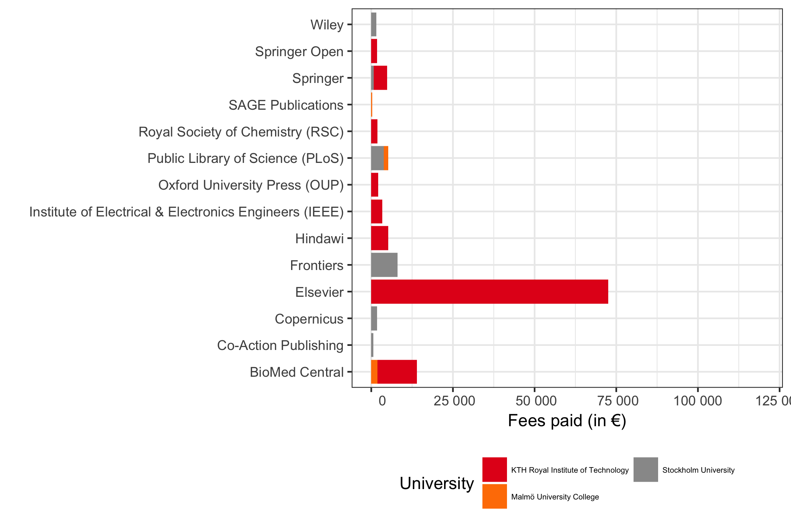
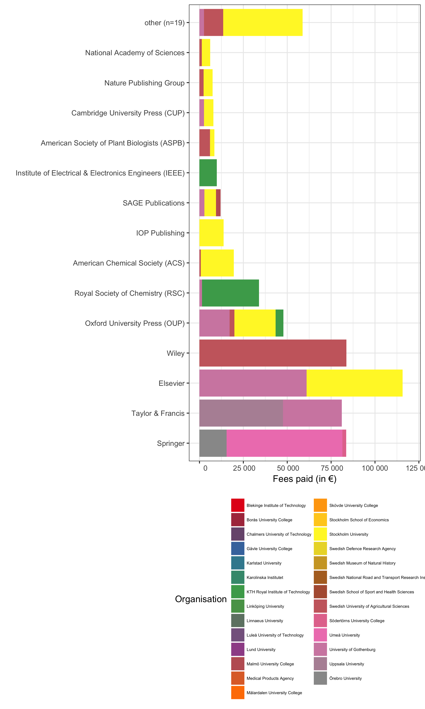
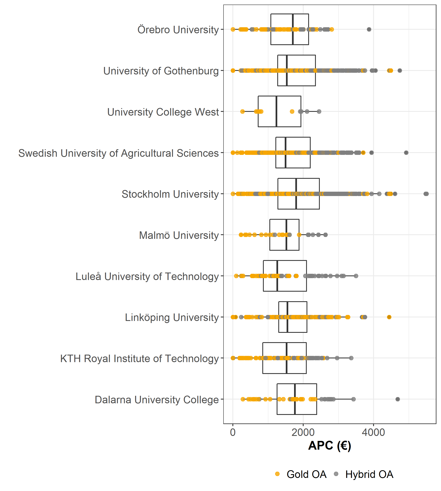

Open APC Sweden - Statistics
============================

This is a sample of statistics from the pilot project Open APC Sweden,
aiming at gathering data about article processing charges (APC's) paid
by Swedish universities. The statistics covers journal articles from a
few pilot contributors. Please see the [project
wiki](https://github.com/Kungbib/openapc-se/wiki) for more information
about the project and instructions on how to contribute.

Contributing organisations and publishers
-----------------------------------------

Four Swedish universities have reported APC costs for their articles so
far. These are *KTH Royal Institute of Technology*, *Stockholm
University*, *University of Gothenburg* and *Swedish University of
Agricultural Sciences*. Three publishers: *Springer* (within the
Sprincer Compact offsetting agreement), *Taylor and Francis*, and
*Karger* have also supplied Open APC Sweden with data. This
publisher-supplied data leads to publishing costs being reported for a
number of Swedish research institutions which not yet have supplied us
with data actively.

Dataset
-------

Information on both open access journal articles and open access
publication of articles in toll-access journals ("hybrid") are provided.
You may view the dataset at the [project page in
GitHub](https://github.com/Kungbib/openapc-se/blob/master/data/apc_se.csv).

In total, **3 166 795 €** for **1 794 articles** were paid by the **27
organisations** that have APC data from so far. The **average APC is 1
765 €** and the **median is APC 2 132 €**.

<table>
<thead>
<tr class="header">
<th align="right">Organisations</th>
<th align="right">Publications</th>
<th align="right">Total APC (€)</th>
<th align="right">Average APC (€)</th>
<th align="right">Median APC (€)</th>
</tr>
</thead>
<tbody>
<tr class="odd">
<td align="right">27</td>
<td align="right">1 794</td>
<td align="right">3 166 795</td>
<td align="right">1 765</td>
<td align="right">2 132</td>
</tr>
</tbody>
</table>

Open Access Articles (Total: both "gold" and "hybrid" OA)
---------------------------------------------------------

At the moment, the dataset contains the following information:

-   Number of articles: **1 794**
-   Total expenditure: **3 166 795 €**
-   Average fee: **1 765 €**
-   Median fee: **2 132 €**

Articles and APC costs per institution:

<table>
<thead>
<tr class="header">
<th></th>
<th align="right">Articles</th>
<th align="right">Fees paid (€)</th>
<th align="right">Mean APC (€)</th>
<th align="right">Median APC (€)</th>
</tr>
</thead>
<tbody>
<tr class="odd">
<td>Blekinge Institute of Technology</td>
<td align="right">1</td>
<td align="right">2 200</td>
<td align="right">2 200</td>
<td align="right">2 200</td>
</tr>
<tr class="even">
<td>Borås University College</td>
<td align="right">2</td>
<td align="right">4 400</td>
<td align="right">2 200</td>
<td align="right">2 200</td>
</tr>
<tr class="odd">
<td>Chalmers University of Technology</td>
<td align="right">36</td>
<td align="right">76 065</td>
<td align="right">2 113</td>
<td align="right">2 200</td>
</tr>
<tr class="even">
<td>Gävle University College</td>
<td align="right">6</td>
<td align="right">13 200</td>
<td align="right">2 200</td>
<td align="right">2 200</td>
</tr>
<tr class="odd">
<td>Karlstad University</td>
<td align="right">4</td>
<td align="right">8 800</td>
<td align="right">2 200</td>
<td align="right">2 200</td>
</tr>
<tr class="even">
<td>Karolinska Institutet</td>
<td align="right">112</td>
<td align="right">201 040</td>
<td align="right">1 795</td>
<td align="right">2 200</td>
</tr>
<tr class="odd">
<td>KTH Royal Institute of Technology</td>
<td align="right">209</td>
<td align="right">320 849</td>
<td align="right">1 535</td>
<td align="right">1 905</td>
</tr>
<tr class="even">
<td>Linköping University</td>
<td align="right">59</td>
<td align="right">105 643</td>
<td align="right">1 791</td>
<td align="right">2 200</td>
</tr>
<tr class="odd">
<td>Linnaeus University</td>
<td align="right">10</td>
<td align="right">22 000</td>
<td align="right">2 200</td>
<td align="right">2 200</td>
</tr>
<tr class="even">
<td>Luleå University of Technology</td>
<td align="right">24</td>
<td align="right">52 743</td>
<td align="right">2 198</td>
<td align="right">2 200</td>
</tr>
<tr class="odd">
<td>Lund University</td>
<td align="right">126</td>
<td align="right">245 255</td>
<td align="right">1 946</td>
<td align="right">2 200</td>
</tr>
<tr class="even">
<td>Malmö University College</td>
<td align="right">14</td>
<td align="right">27 690</td>
<td align="right">1 978</td>
<td align="right">2 200</td>
</tr>
<tr class="odd">
<td>Medical Products Agency</td>
<td align="right">1</td>
<td align="right">2 200</td>
<td align="right">2 200</td>
<td align="right">2 200</td>
</tr>
<tr class="even">
<td>Mälardalen University College</td>
<td align="right">5</td>
<td align="right">11 000</td>
<td align="right">2 200</td>
<td align="right">2 200</td>
</tr>
<tr class="odd">
<td>Skövde University College</td>
<td align="right">3</td>
<td align="right">6 600</td>
<td align="right">2 200</td>
<td align="right">2 200</td>
</tr>
<tr class="even">
<td>Stockholm School of Economics</td>
<td align="right">1</td>
<td align="right">2 200</td>
<td align="right">2 200</td>
<td align="right">2 200</td>
</tr>
<tr class="odd">
<td>Stockholm University</td>
<td align="right">282</td>
<td align="right">530 976</td>
<td align="right">1 883</td>
<td align="right">2 006</td>
</tr>
<tr class="even">
<td>Swedish Defence Research Agency</td>
<td align="right">1</td>
<td align="right">2 200</td>
<td align="right">2 200</td>
<td align="right">2 200</td>
</tr>
<tr class="odd">
<td>Swedish Museum of Natural History</td>
<td align="right">2</td>
<td align="right">4 400</td>
<td align="right">2 200</td>
<td align="right">2 200</td>
</tr>
<tr class="even">
<td>Swedish National Road and Transport Research Institute</td>
<td align="right">1</td>
<td align="right">2 200</td>
<td align="right">2 200</td>
<td align="right">2 200</td>
</tr>
<tr class="odd">
<td>Swedish School of Sport and Health Sciences</td>
<td align="right">1</td>
<td align="right">2 200</td>
<td align="right">2 200</td>
<td align="right">2 200</td>
</tr>
<tr class="even">
<td>Swedish University of Agricultural Sciences</td>
<td align="right">394</td>
<td align="right">634 067</td>
<td align="right">1 609</td>
<td align="right">1 454</td>
</tr>
<tr class="odd">
<td>Södertörns University College</td>
<td align="right">1</td>
<td align="right">2 200</td>
<td align="right">2 200</td>
<td align="right">2 200</td>
</tr>
<tr class="even">
<td>Umeå University</td>
<td align="right">65</td>
<td align="right">115 176</td>
<td align="right">1 772</td>
<td align="right">2 200</td>
</tr>
<tr class="odd">
<td>University of Gothenburg</td>
<td align="right">304</td>
<td align="right">580 994</td>
<td align="right">1 911</td>
<td align="right">2 132</td>
</tr>
<tr class="even">
<td>Uppsala University</td>
<td align="right">123</td>
<td align="right">175 096</td>
<td align="right">1 424</td>
<td align="right">2 132</td>
</tr>
<tr class="odd">
<td>Örebro University</td>
<td align="right">7</td>
<td align="right">15 400</td>
<td align="right">2 200</td>
<td align="right">2 200</td>
</tr>
</tbody>
</table>

Articles in Open Access journals ("gold OA")
--------------------------------------------

At the moment, the dataset contains the following information on
articles in open access journals:

-   Number of articles: **722**
-   Total expenditure: **850 035 €**
-   Average fee: **1 177 €**
-   Median fee: **1 231 €**

Articles and APC costs per institution:

<table>
<thead>
<tr class="header">
<th></th>
<th align="right">Articles</th>
<th align="right">Fees paid (€)</th>
<th align="right">Mean APC (€)</th>
<th align="right">Median APC (€)</th>
</tr>
</thead>
<tbody>
<tr class="odd">
<td>Chalmers University of Technology</td>
<td align="right">3</td>
<td align="right">2 142</td>
<td align="right">714</td>
<td align="right">560</td>
</tr>
<tr class="even">
<td>Karolinska Institutet</td>
<td align="right">15</td>
<td align="right">4 371</td>
<td align="right">291</td>
<td align="right">0</td>
</tr>
<tr class="odd">
<td>KTH Royal Institute of Technology</td>
<td align="right">118</td>
<td align="right">134 389</td>
<td align="right">1 139</td>
<td align="right">1 021</td>
</tr>
<tr class="even">
<td>Linköping University</td>
<td align="right">13</td>
<td align="right">8 051</td>
<td align="right">619</td>
<td align="right">413</td>
</tr>
<tr class="odd">
<td>Lund University</td>
<td align="right">14</td>
<td align="right">6 555</td>
<td align="right">468</td>
<td align="right">198</td>
</tr>
<tr class="even">
<td>Malmö University College</td>
<td align="right">4</td>
<td align="right">4 007</td>
<td align="right">1 002</td>
<td align="right">890</td>
</tr>
<tr class="odd">
<td>Stockholm University</td>
<td align="right">92</td>
<td align="right">139 765</td>
<td align="right">1 519</td>
<td align="right">1 402</td>
</tr>
<tr class="even">
<td>Swedish University of Agricultural Sciences</td>
<td align="right">258</td>
<td align="right">327 863</td>
<td align="right">1 271</td>
<td align="right">1 245</td>
</tr>
<tr class="odd">
<td>Umeå University</td>
<td align="right">13</td>
<td align="right">6 104</td>
<td align="right">470</td>
<td align="right">575</td>
</tr>
<tr class="even">
<td>University of Gothenburg</td>
<td align="right">147</td>
<td align="right">210 321</td>
<td align="right">1 431</td>
<td align="right">1 404</td>
</tr>
<tr class="odd">
<td>Uppsala University</td>
<td align="right">45</td>
<td align="right">6 467</td>
<td align="right">144</td>
<td align="right">0</td>
</tr>
</tbody>
</table>

OA articles in toll-access journals ("hybrid OA")
-------------------------------------------------

In many toll-access journals some of the articles are open access after
a fee has been paid. This model is often called "hybrid open access".
The dataset covers the following data on hybrid open access articles:

-   Number of articles: **1 794**
-   Total expenditure: **3 166 795 €**
-   Average fee: **1 765 €**
-   Median fee: **2 132 €**

The following institutions have contributed its expenditures for hybrid
open access.

<table>
<thead>
<tr class="header">
<th></th>
<th align="right">Articles</th>
<th align="right">Fees paid (€)</th>
<th align="right">Mean APC (€)</th>
<th align="right">Median APC (€)</th>
</tr>
</thead>
<tbody>
<tr class="odd">
<td>Blekinge Institute of Technology</td>
<td align="right">1</td>
<td align="right">2 200</td>
<td align="right">2 200</td>
<td align="right">2 200</td>
</tr>
<tr class="even">
<td>Borås University College</td>
<td align="right">2</td>
<td align="right">4 400</td>
<td align="right">2 200</td>
<td align="right">2 200</td>
</tr>
<tr class="odd">
<td>Chalmers University of Technology</td>
<td align="right">33</td>
<td align="right">73 923</td>
<td align="right">2 240</td>
<td align="right">2 200</td>
</tr>
<tr class="even">
<td>Gävle University College</td>
<td align="right">6</td>
<td align="right">13 200</td>
<td align="right">2 200</td>
<td align="right">2 200</td>
</tr>
<tr class="odd">
<td>Karlstad University</td>
<td align="right">4</td>
<td align="right">8 800</td>
<td align="right">2 200</td>
<td align="right">2 200</td>
</tr>
<tr class="even">
<td>Karolinska Institutet</td>
<td align="right">97</td>
<td align="right">196 669</td>
<td align="right">2 028</td>
<td align="right">2 200</td>
</tr>
<tr class="odd">
<td>KTH Royal Institute of Technology</td>
<td align="right">91</td>
<td align="right">186 460</td>
<td align="right">2 049</td>
<td align="right">2 200</td>
</tr>
<tr class="even">
<td>Linköping University</td>
<td align="right">46</td>
<td align="right">97 592</td>
<td align="right">2 122</td>
<td align="right">2 200</td>
</tr>
<tr class="odd">
<td>Linnaeus University</td>
<td align="right">10</td>
<td align="right">22 000</td>
<td align="right">2 200</td>
<td align="right">2 200</td>
</tr>
<tr class="even">
<td>Luleå University of Technology</td>
<td align="right">24</td>
<td align="right">52 743</td>
<td align="right">2 198</td>
<td align="right">2 200</td>
</tr>
<tr class="odd">
<td>Lund University</td>
<td align="right">112</td>
<td align="right">238 700</td>
<td align="right">2 131</td>
<td align="right">2 200</td>
</tr>
<tr class="even">
<td>Malmö University College</td>
<td align="right">10</td>
<td align="right">23 683</td>
<td align="right">2 368</td>
<td align="right">2 314</td>
</tr>
<tr class="odd">
<td>Medical Products Agency</td>
<td align="right">1</td>
<td align="right">2 200</td>
<td align="right">2 200</td>
<td align="right">2 200</td>
</tr>
<tr class="even">
<td>Mälardalen University College</td>
<td align="right">5</td>
<td align="right">11 000</td>
<td align="right">2 200</td>
<td align="right">2 200</td>
</tr>
<tr class="odd">
<td>Skövde University College</td>
<td align="right">3</td>
<td align="right">6 600</td>
<td align="right">2 200</td>
<td align="right">2 200</td>
</tr>
<tr class="even">
<td>Stockholm School of Economics</td>
<td align="right">1</td>
<td align="right">2 200</td>
<td align="right">2 200</td>
<td align="right">2 200</td>
</tr>
<tr class="odd">
<td>Stockholm University</td>
<td align="right">190</td>
<td align="right">391 211</td>
<td align="right">2 059</td>
<td align="right">2 200</td>
</tr>
<tr class="even">
<td>Swedish Defence Research Agency</td>
<td align="right">1</td>
<td align="right">2 200</td>
<td align="right">2 200</td>
<td align="right">2 200</td>
</tr>
<tr class="odd">
<td>Swedish Museum of Natural History</td>
<td align="right">2</td>
<td align="right">4 400</td>
<td align="right">2 200</td>
<td align="right">2 200</td>
</tr>
<tr class="even">
<td>Swedish National Road and Transport Research Institute</td>
<td align="right">1</td>
<td align="right">2 200</td>
<td align="right">2 200</td>
<td align="right">2 200</td>
</tr>
<tr class="odd">
<td>Swedish School of Sport and Health Sciences</td>
<td align="right">1</td>
<td align="right">2 200</td>
<td align="right">2 200</td>
<td align="right">2 200</td>
</tr>
<tr class="even">
<td>Swedish University of Agricultural Sciences</td>
<td align="right">136</td>
<td align="right">306 205</td>
<td align="right">2 252</td>
<td align="right">2 200</td>
</tr>
<tr class="odd">
<td>Södertörns University College</td>
<td align="right">1</td>
<td align="right">2 200</td>
<td align="right">2 200</td>
<td align="right">2 200</td>
</tr>
<tr class="even">
<td>Umeå University</td>
<td align="right">52</td>
<td align="right">109 072</td>
<td align="right">2 098</td>
<td align="right">2 200</td>
</tr>
<tr class="odd">
<td>University of Gothenburg</td>
<td align="right">157</td>
<td align="right">370 673</td>
<td align="right">2 361</td>
<td align="right">2 200</td>
</tr>
<tr class="even">
<td>Uppsala University</td>
<td align="right">78</td>
<td align="right">168 629</td>
<td align="right">2 162</td>
<td align="right">2 200</td>
</tr>
<tr class="odd">
<td>Örebro University</td>
<td align="right">7</td>
<td align="right">15 400</td>
<td align="right">2 200</td>
<td align="right">2 200</td>
</tr>
</tbody>
</table>

Distribution over publishers
----------------------------

### All types of OA articles

### OA journal articles

APC fees paid per publisher with indication of contribution from each
university.

### Hybrid OA articles in toll access journals

APC fees paid per publisher with indication of contribution from each
university.

Fees and average APC paid per organisation
------------------------------------------

Fees and average APC per publisher
----------------------------------

Average and distribution of APC's by year
-----------------------------------------

Average APC trend by year
-------------------------

Acknowledgement
---------------

This project follows the [Open APC
Initiative](https://github.com/OpenAPC/openapc-de) to share data on paid
APCs. It recognises efforts from
[JISC](https://www.jisc-collections.ac.uk/Jisc-Monitor/APC-data-collection/)
and
[FWF](https://figshare.com/articles/Austrian_Science_Fund_FWF_Publication_Cost_Data_2014/1378610)
to standardise APC reporting.

Contact
-------

For general comments, email Beate Eellend at the National Library of
Sweden: **beate.eellend \[at\] kb.se**

For technical issues, email Ulf Kronman at the National Library of
Sweden: **ulf.kronman \[at\] kb.se**
