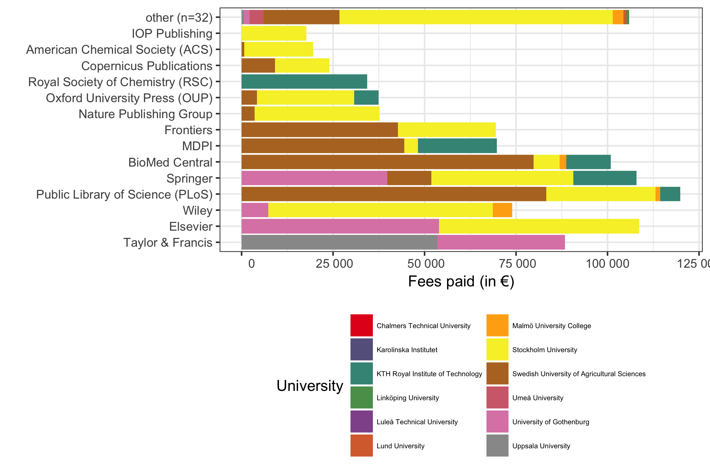

Open APC Sweden - Statistics
============================

This is a sample of statistics from the pilot project Open APC Sweden,
aiming at gathering data about article processing charges (APC's) paid
by Swedish universities. The statistics covers journal articles from a
few pilot contributors. Please see the [project
wiki](https://github.com/Kungbib/openapc-se/wiki) for more information
about the project and instructions on how to contribute.

Contributing organisations and publishers
-----------------------------------------

Four Swedish universities have reported APC costs for their articles so
far. These are *KTH Royal Institute of Technology*, *Stockholm
University*, *University of Gothenburg* and *Swedish University of
Agricultural Sciences*. The two publishers *Taylor and Francis*, and
*Karger* have also supplied Open APC Sweden with data. This
publisher-supplied data leads to publishing costs being reported for a
number of Swedish research institutions which not yet have supplied us
with data actively.

<table>
<thead>
<tr class="header">
<th align="left">Acronym</th>
<th align="left">Organisation</th>
</tr>
</thead>
<tbody>
<tr class="odd">
<td align="left">cth</td>
<td align="left">Chalmers Technical University</td>
</tr>
<tr class="even">
<td align="left">gu</td>
<td align="left">University of Gothenburg</td>
</tr>
<tr class="odd">
<td align="left">ki</td>
<td align="left">Karolinska Institutet</td>
</tr>
<tr class="even">
<td align="left">kth</td>
<td align="left">KTH Royal Institute of Technology</td>
</tr>
<tr class="odd">
<td align="left">ltu</td>
<td align="left">Luleå Technical University</td>
</tr>
<tr class="even">
<td align="left">lu</td>
<td align="left">Lund University</td>
</tr>
<tr class="odd">
<td align="left">liu</td>
<td align="left">Linköping University</td>
</tr>
<tr class="even">
<td align="left">mah</td>
<td align="left">Malmö University College</td>
</tr>
<tr class="odd">
<td align="left">sh</td>
<td align="left">Södertörn University</td>
</tr>
<tr class="even">
<td align="left">slu</td>
<td align="left">Swedish University of Agricultural Sciences</td>
</tr>
<tr class="odd">
<td align="left">su</td>
<td align="left">Stockholm University</td>
</tr>
<tr class="even">
<td align="left">umu</td>
<td align="left">Umeå University</td>
</tr>
<tr class="odd">
<td align="left">uu</td>
<td align="left">Uppsala University</td>
</tr>
</tbody>
</table>

Dataset
-------

Information on both open access journal articles and open access
publication of articles in toll-access journals ("hybrid") are provided.
You may view the dataset at the [project page in
GitHub](https://github.com/Kungbib/openapc-se/blob/master/data/apc_se.csv).

In total, **1 689 336 €** for **1 087 articles** were paid by the **12
universities** that have delivered APC data so far. The **average APC is
1 554 €** and the **median is APC 1 504 €**.

<table>
<thead>
<tr class="header">
<th align="right">Universities</th>
<th align="right">Publications</th>
<th align="right">Total APC (€)</th>
<th align="right">Average APC (€)</th>
<th align="right">Median APC (€)</th>
</tr>
</thead>
<tbody>
<tr class="odd">
<td align="right">12</td>
<td align="right">1 087</td>
<td align="right">1 689 336</td>
<td align="right">1 554</td>
<td align="right">1 504</td>
</tr>
</tbody>
</table>

Open Access Articles (Total: both "gold" and "hybrid" OA)
---------------------------------------------------------

At the moment, the dataset contains the following information:

-   Number of articles: **1 087**
-   Total expenditure: **1 689 336 €**
-   Average fee: **1 554 €**
-   Median fee: **1 504 €**

Articles and APC costs per institution:

<table>
<thead>
<tr class="header">
<th></th>
<th align="right">Articles</th>
<th align="right">Fees paid (€)</th>
<th align="right">Mean APC (€)</th>
<th align="right">Median APC (€)</th>
</tr>
</thead>
<tbody>
<tr class="odd">
<td>Chalmers Technical University</td>
<td align="right">10</td>
<td align="right">18 865</td>
<td align="right">1 886</td>
<td align="right">2 132</td>
</tr>
<tr class="even">
<td>Karolinska Institutet</td>
<td align="right">40</td>
<td align="right">42 640</td>
<td align="right">1 066</td>
<td align="right">755</td>
</tr>
<tr class="odd">
<td>KTH Royal Institute of Technology</td>
<td align="right">165</td>
<td align="right">224 049</td>
<td align="right">1 358</td>
<td align="right">1 505</td>
</tr>
<tr class="even">
<td>Linköping University</td>
<td align="right">25</td>
<td align="right">30 843</td>
<td align="right">1 234</td>
<td align="right">1 169</td>
</tr>
<tr class="odd">
<td>Luleå Technical University</td>
<td align="right">8</td>
<td align="right">17 543</td>
<td align="right">2 193</td>
<td align="right">2 429</td>
</tr>
<tr class="even">
<td>Lund University</td>
<td align="right">50</td>
<td align="right">78 055</td>
<td align="right">1 561</td>
<td align="right">2 132</td>
</tr>
<tr class="odd">
<td>Malmö University College</td>
<td align="right">10</td>
<td align="right">18 890</td>
<td align="right">1 889</td>
<td align="right">2 280</td>
</tr>
<tr class="even">
<td>Stockholm University</td>
<td align="right">246</td>
<td align="right">451 776</td>
<td align="right">1 836</td>
<td align="right">1 814</td>
</tr>
<tr class="odd">
<td>Swedish University of Agricultural Sciences</td>
<td align="right">363</td>
<td align="right">565 867</td>
<td align="right">1 559</td>
<td align="right">1 386</td>
</tr>
<tr class="even">
<td>Umeå University</td>
<td align="right">35</td>
<td align="right">49 176</td>
<td align="right">1 405</td>
<td align="right">1 585</td>
</tr>
<tr class="odd">
<td>University of Gothenburg</td>
<td align="right">67</td>
<td align="right">137 535</td>
<td align="right">2 053</td>
<td align="right">2 345</td>
</tr>
<tr class="even">
<td>Uppsala University</td>
<td align="right">68</td>
<td align="right">54 096</td>
<td align="right">796</td>
<td align="right">0</td>
</tr>
</tbody>
</table>

Articles in Open Access journals ("gold OA")
--------------------------------------------

At the moment, the dataset contains the following information on
articles in open access journals:

-   Number of articles: **594**
-   Total expenditure: **669 997 €**
-   Average fee: **1 128 €**
-   Median fee: **1 180 €**

Articles and APC costs per institution:

<table>
<thead>
<tr class="header">
<th></th>
<th align="right">Articles</th>
<th align="right">Fees paid (€)</th>
<th align="right">Mean APC (€)</th>
<th align="right">Median APC (€)</th>
</tr>
</thead>
<tbody>
<tr class="odd">
<td>Chalmers Technical University</td>
<td align="right">3</td>
<td align="right">2 142</td>
<td align="right">714</td>
<td align="right">560</td>
</tr>
<tr class="even">
<td>Karolinska Institutet</td>
<td align="right">15</td>
<td align="right">4 371</td>
<td align="right">291</td>
<td align="right">0</td>
</tr>
<tr class="odd">
<td>KTH Royal Institute of Technology</td>
<td align="right">118</td>
<td align="right">134 389</td>
<td align="right">1 139</td>
<td align="right">1 021</td>
</tr>
<tr class="even">
<td>Linköping University</td>
<td align="right">13</td>
<td align="right">8 051</td>
<td align="right">619</td>
<td align="right">413</td>
</tr>
<tr class="odd">
<td>Lund University</td>
<td align="right">14</td>
<td align="right">6 555</td>
<td align="right">468</td>
<td align="right">198</td>
</tr>
<tr class="even">
<td>Malmö University College</td>
<td align="right">4</td>
<td align="right">4 007</td>
<td align="right">1 002</td>
<td align="right">890</td>
</tr>
<tr class="odd">
<td>Stockholm University</td>
<td align="right">92</td>
<td align="right">139 765</td>
<td align="right">1 519</td>
<td align="right">1 402</td>
</tr>
<tr class="even">
<td>Swedish University of Agricultural Sciences</td>
<td align="right">258</td>
<td align="right">327 863</td>
<td align="right">1 271</td>
<td align="right">1 245</td>
</tr>
<tr class="odd">
<td>Umeå University</td>
<td align="right">13</td>
<td align="right">6 104</td>
<td align="right">470</td>
<td align="right">575</td>
</tr>
<tr class="even">
<td>University of Gothenburg</td>
<td align="right">19</td>
<td align="right">30 283</td>
<td align="right">1 594</td>
<td align="right">755</td>
</tr>
<tr class="odd">
<td>Uppsala University</td>
<td align="right">45</td>
<td align="right">6 467</td>
<td align="right">144</td>
<td align="right">0</td>
</tr>
</tbody>
</table>

OA articles in toll-access journals ("hybrid OA")
-------------------------------------------------

In many toll-access journals some of the articles are open access after
a fee has been paid. This model is often called "hybrid open access".
The dataset covers the following data on hybrid open access articles:

-   Number of articles: **1 087**
-   Total expenditure: **1 689 336 €**
-   Average fee: **1 554 €**
-   Median fee: **1 504 €**

The following institutions have contributed its expenditures for hybrid
open access.

<table>
<thead>
<tr class="header">
<th></th>
<th align="right">Articles</th>
<th align="right">Fees paid (€)</th>
<th align="right">Mean APC (€)</th>
<th align="right">Median APC (€)</th>
</tr>
</thead>
<tbody>
<tr class="odd">
<td>Chalmers Technical University</td>
<td align="right">7</td>
<td align="right">16 723</td>
<td align="right">2 389</td>
<td align="right">2 429</td>
</tr>
<tr class="even">
<td>Karolinska Institutet</td>
<td align="right">25</td>
<td align="right">38 269</td>
<td align="right">1 531</td>
<td align="right">1 473</td>
</tr>
<tr class="odd">
<td>KTH Royal Institute of Technology</td>
<td align="right">47</td>
<td align="right">89 660</td>
<td align="right">1 908</td>
<td align="right">1 905</td>
</tr>
<tr class="even">
<td>Linköping University</td>
<td align="right">12</td>
<td align="right">22 792</td>
<td align="right">1 899</td>
<td align="right">2 132</td>
</tr>
<tr class="odd">
<td>Luleå Technical University</td>
<td align="right">8</td>
<td align="right">17 543</td>
<td align="right">2 193</td>
<td align="right">2 429</td>
</tr>
<tr class="even">
<td>Lund University</td>
<td align="right">36</td>
<td align="right">71 500</td>
<td align="right">1 986</td>
<td align="right">2 132</td>
</tr>
<tr class="odd">
<td>Malmö University College</td>
<td align="right">6</td>
<td align="right">14 883</td>
<td align="right">2 480</td>
<td align="right">2 530</td>
</tr>
<tr class="even">
<td>Stockholm University</td>
<td align="right">154</td>
<td align="right">312 011</td>
<td align="right">2 026</td>
<td align="right">2 200</td>
</tr>
<tr class="odd">
<td>Swedish University of Agricultural Sciences</td>
<td align="right">105</td>
<td align="right">238 005</td>
<td align="right">2 267</td>
<td align="right">2 387</td>
</tr>
<tr class="even">
<td>Umeå University</td>
<td align="right">22</td>
<td align="right">43 072</td>
<td align="right">1 958</td>
<td align="right">2 132</td>
</tr>
<tr class="odd">
<td>University of Gothenburg</td>
<td align="right">48</td>
<td align="right">107 252</td>
<td align="right">2 234</td>
<td align="right">2 357</td>
</tr>
<tr class="even">
<td>Uppsala University</td>
<td align="right">23</td>
<td align="right">47 629</td>
<td align="right">2 071</td>
<td align="right">2 132</td>
</tr>
</tbody>
</table>

Distribution over publishers
----------------------------

### All types of OA articles

APC fees paid per publisher with indication of contribution from each
university.

### OA journal articles

APC fees paid per publisher with indication of contribution from each
university.

### Hybrid OA articles in toll access journals

APC fees paid per publisher with indication of contribution from each
university.

Fees paid per university
------------------------

Average fee per publisher
-------------------------

Average and distribution of APC's by year
-----------------------------------------

Acknowledgement
---------------

This project follows the [Open APC
Initiative](https://github.com/OpenAPC/openapc-de) to share data on paid
APCs. It recognises efforts from
[JISC](https://www.jisc-collections.ac.uk/Jisc-Monitor/APC-data-collection/)
and
[FWF](https://figshare.com/articles/Austrian_Science_Fund_FWF_Publication_Cost_Data_2014/1378610)
to standardise APC reporting.

Contact
-------

For general comments, email Beate Eellend at the National Library of
Sweden: **beate.eellend \[at\] kb.se**

For technical issues, email Ulf Kronman at the National Library of
Sweden: **ulf.kronman \[at\] kb.se**
